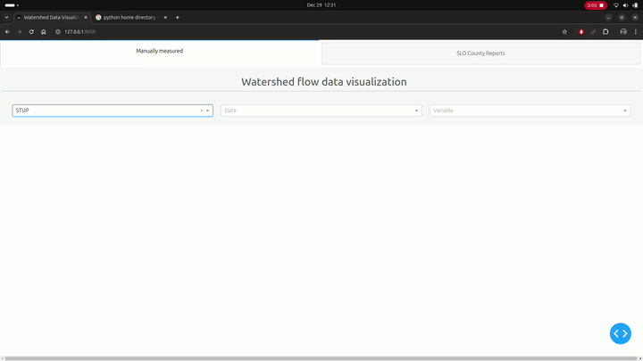

# flowdataviz

Check out this document for more details: [Google doc](https://docs.google.com/document/d/1l-gVwYZWv5JqQe_aZ50hXfL84tIgdjkhtddLv-gZDsg/edit?usp=sharing)

How to use:

* Run in an interactive jupyter notebook.
* Requires the following modules: dash, pandas, dash_bootstrap_components, json, reqests, datettime, pydrive, oauth2client, bs4,
numpy, and mpl_axes_aligner (see `requirements.txt` generated using `pip install pipreqs; pipreqs .`)
* Install all dependencies as `pip install -r requirements.txt`

The dashboard app, app.py requires dash, plotly, and pandas. 
It can be run with by command line `python3 app.py`, and will open locally at port 127.0.0.1:8050 .
This url can be opened with any internet browser.

Dash Generator is an (optional) notebook that writes and runs the app.py file.  

Here is how it looks like:
